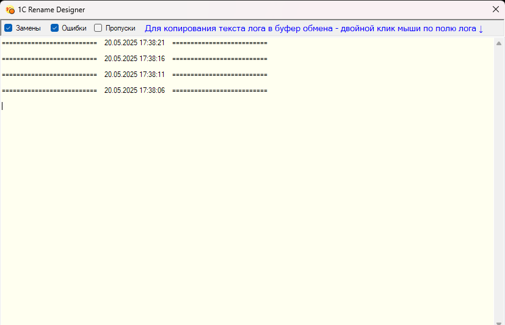

</img>

# Rename designer 1C  

### Переименование конфигуратора 1С 
## Добавляет в заголовок окон конфигураторов  имя открытой базы  

---
### Description  

- Небольшая программка для переименования открытых окон конфигуратора 1С. 
- Добавляет в заголовок окон конфигураторов имя открытой базы, как оно зарегистрировано в списке баз 1С.  
- Для автоматической работы необходимо поместить программу в автозапуск Windows.  
- Для работы необходим .Net Framework 4.8  